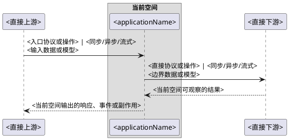

# 时序设计方法

用于设计当前空间与直接上下游之间的真实运行时序。这里的端到端以当前空间为中心，只覆盖直接上游如何进入当前空间、当前空间如何与直接下游交互，以及当前空间可观察的响应或副作用；上下游空间内部、上上游和下下游不属于本图。

## 触发

- 本次正式需求或技术方案新增、改变当前空间与直接上下游的交互，或实施必须明确其顺序、协议、数据和结果时，Agent 自行创建时序图，用户无需显式提出“时序图”或“PlantUML”。
- 只有当前空间内部结构或调用发生变化，且不影响跨边界交互时，不创建时序图。
- 无法确定具体场景或直接上下游边界时，在主方案记录待确认事实及阻塞影响，边界明确后再创建。

## 产物

- 保存为 `方案/时序图/<NN>-<链路名称>.puml`，一条真实链路一个文件；该文件是对应时序图的唯一图形真源。
- `方案/方案.md` 记录触发结论、覆盖场景和源文件链接，不复制完整箭头链路。
- 当前项目治理入口明确了可用 PlantUML 预览方式且环境可用时，用同一份源码实际渲染并核对图形区域，不把编辑器或源码页面当作图形预览。临时预览遵守项目临时目录规则，与工作项事实源分离。
- 预览失败时仍交付源码并记录未预览事实；渲染成功只证明语法和可见性，链路正确性仍按当前空间事实和已确定的目标设计核对。
- 预览页示例、当前浏览器页面或其他环境状态不构成链路事实，不据此新增参与者或扩展上下游。

## 链路边界

一张图只描述当前空间一个 `applicationName` 的一条真实链路：

```text
直接上游
  → 当前空间的真实入口
  → 当前空间 applicationName
  → 当前空间直接交互的微服务、外部系统、中间件或资源
```

- `applicationName` 从当前宿主生效的项目治理入口中 `Java Package 标识` 下的 `项目` 字段读取；无法唯一确认时，在主方案记录阻塞，不创建该图。
- 上下游只作为当前空间直接交互的边界参与者；只画当前空间能够证明的交互，不展开其内部，也不继续推断上上游或下下游。
- 上游是前端时写真实页面入口及其实际调用的 HTTP method/path；其他上游写真实协议、事件、任务或操作入口。
- 中心只表示当前空间的 `applicationName`；Controller、Service、Client、Mapper 等进程内责任不作为同级参与者。
- 每条箭头写清方向、协议或操作、同步、异步或流式方式，以及边界上实际传输的数据或模型；只保留影响当前空间可观察结果的成功、失败或返回路径。
- 现状取自当前空间的源码、页面、配置、契约和运行事实；目标设计取自正式需求和主方案中的已确定决定。未知内容标为“待确认”，不根据上下游常见实现补全。
- 当前事实已有 `flowId` 时沿用现有标识；没有时不为画图额外创建标识体系。
- 按目标项目已有 PlantUML 风格组织参与者、箭头和必要分支。

## 最小示例



按真实链路删除不存在的返回箭头并增加必要分支；不在上下游参与者内部添加节点，也不在其外侧继续添加上上游或下下游。

## 完成判据

图中的参与者和交互均可由当前空间事实或已确定的目标设计定位，当前与目标状态明确区分；图止于直接上下游边界，能够解释当前空间的输入、输出和直接副作用，无需猜测其他空间或进程内实现。
